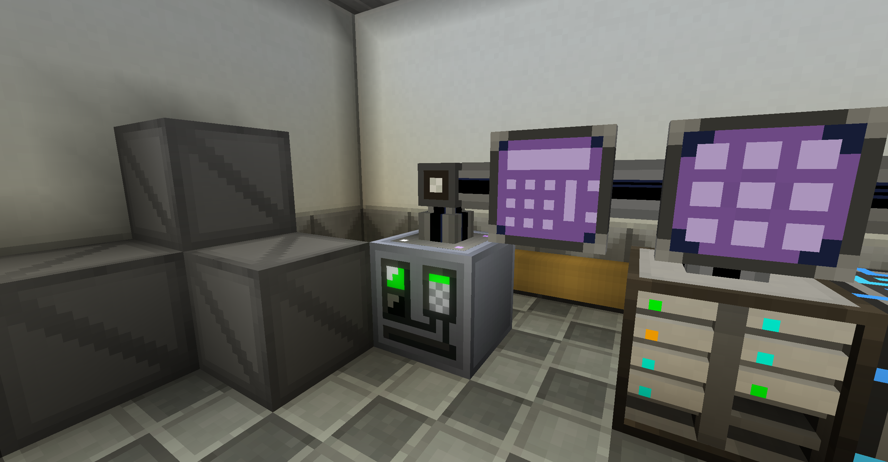
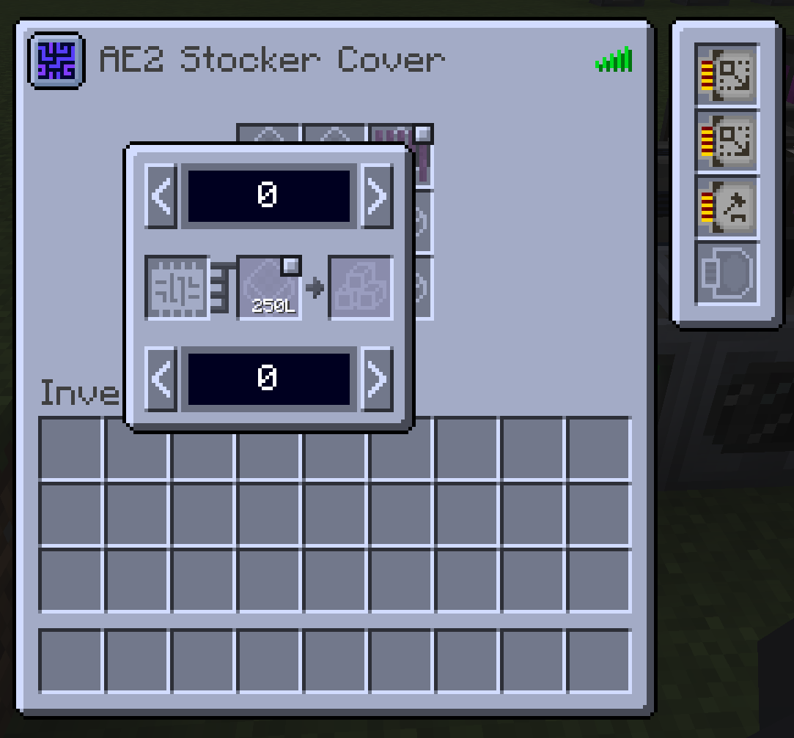

# Gregenergistics

## What is this?

Gregenergistics is an updated version of [GregTech Energistics](https://github.com/solidDoWant/GregTech-Energistics) made by solidDoWant, which adds GregTech Community Edition and Applied Energistics 2 items/block to add additional interoperability.

Current features:
* AE2 Stocker Cover: a cover that handles passive crafting (now with an improved GUI!). 

It pulls items and fluids from the connected AE2 network and stocks target items/fluids up to a predefined upper limit once their quantity in the AE storage grid falls below a set lower limit. It is designed to be compatible with all GTCEu single-block machines and can be used alongside a crafting upgrade for chained production, or capacity upgrades for expanded pattern slots.

## Bug

Yes this is almost certainly to be buggy 'cause I can't code. Feel free to open issues. (P.S. I cen't spall aithar.)

⚠Caution: Currently this mod is causing significant lag.

## Credit

- [solidDoWant](https://github.com/solidDoWant) for making the original GregTech Energistics mod
- [GregTechCEu Team](https://github.com/GregTechCEu) for buildscripts

